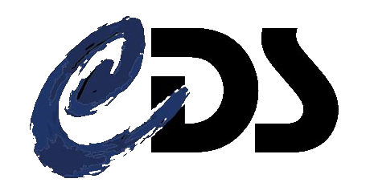

<!-- markdownlint-disable MD033 -->

# Accessing and using astronomical data: a series of Jupyter notebooks tutorials

[](https://zenodo.org/badge/latestdoi/224865065)
[](https://github.com/psf/black)
[](https://github.com/charliermarsh/ruff "https://github.com/charliermarsh/ruff")

Welcome to the repository of Strasbourg astronomical Data Center [CDS](https://cds.u-strasbg.fr/ "https://cds.u-strasbg.fr/") jupyter notebooks.



All tutorials here illustrate how astronomers can search, find, and access data they need from archives across the world. We offer a focus on archives compliant with Virtual Observatory (VO) protocols and standards, as defined by the International Virtual Observatory Alliance ([IVOA](https://www.ivoa.net/ "https://www.ivoa.net/")).

Some tutorials hosted here are based on [EURO-VO tutorials](https://www.euro-vo.org/scientific-tutorials/ "https://www.euro-vo.org/scientific-tutorials/") usually with the same or a similar name.

***

## Table of contents

- [Accessing and using astronomical data: a series of Jupyter notebooks tutorials](#accessing-and-using-astronomical-data-a-series-of-jupyter-notebooks-tutorials)
  - [Table of contents](#table-of-contents)
  - [How to use the tutorials](#how-to-use-the-tutorials)
    - [On your machine](#on-your-machine)
    - [In github codespaces](#in-github-codespaces)
    - [As a book](#as-a-book)
  - [Flight plan](#flight-plan)
    - [1. Intro to CDS services in notebooks](#1-intro-to-cds-services-in-notebooks)
    - [2. Arp peculiar galaxies catalog \_\_ First steps with MOCs](#2-arp-peculiar-galaxies-catalog-__-first-steps-with-mocs)
    - [3. Abel1656, The Coma Cluster of Galaxies \_\_ The Simple Spectral Access Protocol](#3-abel1656-the-coma-cluster-of-galaxies-__-the-simple-spectral-access-protocol)
    - [4. High Energy sources \_\_ advanced use of CDS services](#4-high-energy-sources-__-advanced-use-of-cds-services)
    - [5. Brown Dwarf search \_\_ cross-matching catalogs](#5-brown-dwarf-search-__-cross-matching-catalogs)
    - [6. Advanced usage of MOC to explore complex regions of interest](#6-advanced-usage-of-moc-to-explore-complex-regions-of-interest)
    - [7. Multi Messenger Astronomy \_\_ Generation of an observation plan with MOCs](#7-multi-messenger-astronomy-__-generation-of-an-observation-plan-with-mocs)
  - [Additional tutorials used in past conferences and schools](#additional-tutorials-used-in-past-conferences-and-schools)
  - [Need help?](#need-help)
  - [Glossary](#glossary)
    - [IVOA Standards](#ivoa-standards)
    - [CDS Services](#cds-services)
  - [Contributions](#contributions)

***

## How to use the tutorials

### On your machine

[](https://www.python.org/downloads/ "https://www.python.org/downloads/")
[](https://github.com/cds-astro/tutorials/actions/workflows/notebooks-check_ubuntu.yml)
[](https://github.com/cds-astro/tutorials/actions/workflows/notebooks-check_windows.yml)
[](https://github.com/cds-astro/tutorials/actions/workflows/notebooks-checks_mac-os.yml)

You can download the notebooks to your personal machine and use them there.

Note the currently supported python versions and the list of dependencies in the file [`requirements.txt`](requirements.txt).

This can be done with the following commands:

```
  git clone https://github.com/cds-astro/tutorials.git
  cd tutorials
  pip install -r requirements.txt
  jupyter lab
```

### In github codespaces

- In Github, you can open a JupyterLab instance. To do so, go in your [`Settings`](https://github.com/settings/profile), then `Codespaces` and in `Editor Preference` choose `Jupyter Lab`. And voilà, you can now launch the tutorials, execute and modify them without any installation!


### As a book

- You can also explore the notebooks in a website here [](https://cds-astro.github.io/tutorials/intro.html "https://cds-astro.github.io/tutorials/intro.html")

## Flight plan

The tutorials come in a recommended order ranging from basic usage of the CDS tools to more advanced examples.

### [1. Intro to CDS services in notebooks](Notebooks/1_Intro_to_CDS_services_in_notebooks.ipynb)

[](https://simbad.cds.unistra.fr/simbad/ "https://simbad.cds.unistra.fr/simbad/")
[](https://aladin.cds.unistra.fr/aladin.gml "https://aladin.cds.unistra.fr/aladin.gml")
[](https://vizier.cds.unistra.fr/viz-bin/VizieR "https://vizier.cds.unistra.fr/viz-bin/VizieR")
[](http://cdsxmatch.u-strasbg.fr/ "http://cdsxmatch.u-strasbg.fr/")
[](https://github.com/astropy/astroquery "https://github.com/astropy/astroquery")
[](https://github.com/astropy/astropy "https://github.com/astropy/astropy")

We show how to call Simbad, Aladin Lite, Vizier and X-match in a Jupyter Notebook.

### [2. Arp peculiar galaxies catalog __ First steps with MOCs](Notebooks/2_Peculiar_galaxies__first_steps_with_MOCs.ipynb)

[](https://vizier.cds.unistra.fr/viz-bin/VizieR "https://vizier.cds.unistra.fr/viz-bin/VizieR")
[](https://aladin.cds.unistra.fr/aladin.gml "https://aladin.cds.unistra.fr/aladin.gml")
[](https://github.com/cds-astro/mocpy "https://github.com/cds-astro/mocpy")
[](https://github.com/astropy/astroquery "https://github.com/astropy/astroquery")
[](https://github.com/astropy/astropy "https://github.com/astropy/astropy")

We explore Arp's Catalog of peculiar Galaxies and extract the galaxies explored both in the SDSS and GALEX surveys by using MOCs.
This tutorial highlights two python modules for querying data : [astroquery](https://astroquery.readthedocs.io/en/latest/index.html "https://astroquery.readthedocs.io/en/latest/index.html") and [pyvo](https://pyvo.readthedocs.io/en/latest/index.html "https://pyvo.readthedocs.io/en/latest/index.html").

### [3. Abel1656, The Coma Cluster of Galaxies __ The Simple Spectral Access Protocol](Notebooks/3_Cluster_of_Galaxies__the_Simple_Spectral_Access_Protocol.ipynb)

[](https://aladin.cds.unistra.fr/aladin.gml "https://aladin.cds.unistra.fr/aladin.gml")
[](https://vizier.cds.unistra.fr/viz-bin/VizieR "https://vizier.cds.unistra.fr/viz-bin/VizieR")
[](http://cdsxmatch.u-strasbg.fr/)
[](https://github.com/ivoa-std/SSA "https://github.com/ivoa-std/SSA")
[](https://simbad.cds.unistra.fr/simbad/ "https://simbad.cds.unistra.fr/simbad/")
[](https://github.com/astropy/astroquery "https://github.com/astropy/astroquery")
[](https://github.com/astropy/astropy "https://github.com/astropy/astropy")
[](https://github.com/astropy/specutils "https://github.com/astropy/specutils")
[](https://github.com/astropy/pyvo "https://github.com/astropy/pyvo")

This tutorial focuses on the Coma Cluster of Galaxies. In particular, we search for redshift information of galaxies in the spatial vicinity of the cluster centre. To get this information we get catalogues with measured redshifts and a spectrum, from which we measure a redshift. It uses the Simple Spectral Access (SSA) protocol of the virtual observatory.

### [4. High Energy sources __ advanced use of CDS services](Notebooks/4_High_Energy_sources__Multi_instrument_multi_wavelength_exploration_using_VO_tools.ipynb)

[](https://simbad.cds.unistra.fr/simbad/ "https://simbad.cds.unistra.fr/simbad/")
[](https://aladin.cds.unistra.fr/aladin.gml "https://aladin.cds.unistra.fr/aladin.gml")
[](http://cdsxmatch.u-strasbg.fr/ "http://cdsxmatch.u-strasbg.fr/")
[](https://vizier.cds.unistra.fr/viz-bin/VizieR "https://vizier.cds.unistra.fr/viz-bin/VizieR")
[](https://github.com/astropy/astroquery "https://github.com/astropy/astroquery")
[](https://github.com/astropy/astropy "https://github.com/astropy/astropy")

For this tutorial we focus on gamma-ray and high energy spectral bands and start by querying suitable catalogues using VO tools. After that we cross-correlate catalogues to find entries for objects in different photon energy bands. We then apply selection criteria to extract sources from a catalogue and use the resulting observational measures of the selected objects to explore possible correlations. We close by displaying spectral energy distributions obtained from different photometric data sets.

### [5. Brown Dwarf search __ cross-matching catalogs](Notebooks/5_Brown_Dwarf_Search__Cross-matching_Catalogs.ipynb)

[](https://simbad.cds.unistra.fr/simbad/ "https://simbad.cds.unistra.fr/simbad/")
[](https://aladin.cds.unistra.fr/aladin.gml "https://aladin.cds.unistra.fr/aladin.gml")
[](http://cdsxmatch.u-strasbg.fr/ "http://cdsxmatch.u-strasbg.fr/")
[](https://vizier.cds.unistra.fr/viz-bin/VizieR "https://vizier.cds.unistra.fr/viz-bin/VizieR")
[](https://github.com/astropy/astroquery "https://github.com/astropy/astroquery")
[](https://github.com/astropy/astropy "https://github.com/astropy/astropy")
[](https://github.com/astropy/pyvo "https://github.com/astropy/pyvo")

Brown dwarfs are objects occupying the gap between the least massive stars and the most massive planets. They are intrinsically faint objects. Hence, heir detection is not straightforward and, in fact, was almost impossible until the advent of global surveys at deep optical and near-infrared bands like SDSS, 2MASS or DENIS. We propose here to mine the 2MASS point source catalogue (2MASS-PSC) and SDSS-DR9 databases to identify T-type brown dwarfs through an appropriate combination of colors in the optical and the infrared, an approach that perfectly fits into the Virtual Observatory.

### [6. Advanced usage of MOC to explore complex regions of interest](Notebooks/6_Advanced_usage_of_MOCs.ipynb)

[](https://vizier.cds.unistra.fr/viz-bin/VizieR "https://vizier.cds.unistra.fr/viz-bin/VizieR")
[](https://github.com/cds-astro/mocpy "https://github.com/cds-astro/mocpy")
[](https://github.com/astropy/astroquery "https://github.com/astropy/astroquery")
[](https://github.com/astropy/astropy "https://github.com/astropy/astropy")
[](https://github.com/astropy/pyvo "https://github.com/astropy/pyvo")

This tutorial is centred on using HiPS and MOC to efficiently reach your science goals. In particular it will help you answer questions such as: What is the footprint of my imaging survey? Where on the sky do we have low foreground extinction? Where do these two regions overlap? How can I get interesting catalogue entries within these regions? This questions are answered by building MOCs from a set of images. We also build a MOC from the pixel values of an all-sky survey. We then move on to query catalogues in an intersection of these MOCs.

### [7. Multi Messenger Astronomy __ Generation of an observation plan with MOCs](Notebooks/7_Multi-messenger_astronomy__Planning_observations_rapidly_with_MOCs.ipynb)

[](https://github.com/cds-astro/mocpy "https://github.com/cds-astro/mocpy")
[](https://aladin.cds.unistra.fr/aladin.gml "https://aladin.cds.unistra.fr/aladin.gml")
[](https://github.com/astropy/pyvo "https://github.com/astropy/pyvo")
[](https://github.com/astropy/astropy "https://github.com/astropy/astropy")
[](https://github.com/astropy/astroquery "https://github.com/astropy/astroquery")

We will first explore Multi-Order Coverage (MOC) data structure manipulation, then we will see how astroplan and Space-Time Multi Order Coverage (STMOC) can be combined to plan observation according to a MOC. The final step is a concrete example illustrating how STMOCs can be built in a few seconds to plan observations from three ground observatories, with the aim to cover of the sky localization produced after detection of a gravitational wave.

## Additional tutorials used in past conferences and schools

Each folder represents a different summer school and the associated tutorials. These are not maintained but still accessible.

## Need help?

Don't hesitate to ask a question in the Q&A of our [`Discussions`](https://github.com/cds-astro/tutorials/discussions/categories/q-a "https://github.com/cds-astro/tutorials/discussions/categories/q-a") section.

## Glossary

### IVOA Standards

- **HiPS**: Hierarchical Progressive Surveys - efficient tiling systems to serve (all-sky) imaging surveys, cubes or catalogues, the user only downloads and sees what they are interested in and the more they zoom the more they see, more information [here](https://aladin.u-strasbg.fr/hips/ "https://aladin.u-strasbg.fr/hips/")
- **MOC** also **SMOC**: MultiOrder Coverage map (or Space MultiOrder Coverage) - efficient way of describing arbitrary patches of the sky, logical operations such as union, intersection of MOC can be calculated, tables can be filtered by MOCs, more information [here](https://ivoa.net/documents/MOC/ "https://ivoa.net/documents/MOC/")
- **STMOC**: Space-Time MultiOrder Coverage map - is a MOC that encompasses time information.
- **SSA**: Simple Spectral Access protocol to access spectrums, more information [here](https://github.com/ivoa-std/SSA "https://github.com/ivoa-std/SSA")
- **SAMP**: Simple Application Messaging Protocol - a messaging system to share information between different astronomical softwares, such as python, Aladin, Topcat, etc. more information [here](https://www.ivoa.net/documents/SAMP/ "https://www.ivoa.net/documents/SAMP/")

### CDS Services

- [](https://simbad.cds.unistra.fr/simbad/ "https://simbad.cds.unistra.fr/simbad/"): dynamic astronomical database of objects appearing in scientific publications, updated every working day,
- [](https://aladin.cds.unistra.fr/aladin.gml "https://aladin.cds.unistra.fr/aladin.gml"): an interactive sky atlas,
- [](https://vizier.cds.unistra.fr/viz-bin/VizieR "https://vizier.cds.unistra.fr/viz-bin/VizieR"): a collection of published astronomical catalogues,
- [](http://cdsxmatch.u-strasbg.fr/ "http://cdsxmatch.u-strasbg.fr/"): an efficient cross-matching tool between very large catalogues,
- [](https://github.com/cds-astro/mocpy "https://github.com/cds-astro/mocpy"): a python library allowing MOC manipulation

## Contributions

Guidelines for contributions can be found in the [discussion section](https://github.com/cds-astro/tutorials/discussions/29 "https://github.com/cds-astro/tutorials/discussions/29")

***
|  |  | _This work has been supported by the ESCAPE project (the European Science Cluster of Astronomy & Particle Physics), funded from the European Union’s Horizon 2020 research and innovation program under grant agreement n°824064, the EOSC (European Open Science Cloud) Future project co-funded by the European Union Horizon Program call INFRAEOSC-03-2020 - grant agreement n°101017536, and the project ASTERICS supported by the European Commission Framework Programme Horizon 2020 Research and Innovation action under grant agreement n°653477._ |
| --- | --- | --- |
